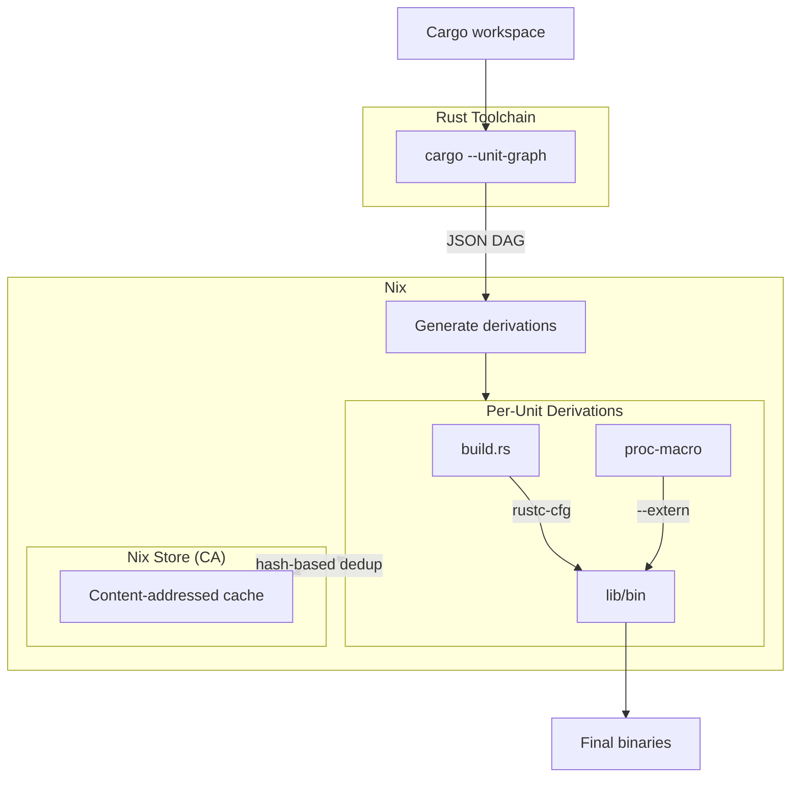

# nix-cargo-unit

Per-unit incremental Rust compilation in Nix using Cargo's `--unit-graph` and content-addressed derivations.

## Features

- **Per-unit caching**: Each compilation unit is a separate Nix derivation
- **Content-addressed**: Uses CA-derivations for deduplication and early cutoff
- **Workspace support**: Handles Cargo workspaces with multiple crates
- **Build scripts**: Executes `build.rs` and captures output directives
- **Proc-macros**: Properly compiles and links procedural macros

## Usage

```nix
{
  inputs.nix-cargo-unit.url = "github:andrewgazelka/nix-cargo-unit";

  outputs = { nix-cargo-unit, nixpkgs, ... }: {
    packages.default = let
      pkgs = nixpkgs.legacyPackages.x86_64-linux;
      cargoUnit = nix-cargo-unit.mkLib pkgs;
    in (cargoUnit.buildWorkspace {
      src = ./.;
      rustToolchain = pkgs.rust-bin.nightly.latest.default;
      contentAddressed = true;
    }).default;
  };
}
```

## Requirements

- Nix with `nix-command` and `flakes` enabled
- Nightly Rust toolchain (for `--unit-graph`)
- Optional: `ca-derivations` experimental feature for content-addressed outputs

## Known Limitations

### macOS CA Derivations

CA derivations fail on macOS due to code signing ([NixOS/nix#6065](https://github.com/NixOS/nix/issues/6065)). Nix's hash rewriting invalidates signatures, causing SIGKILL.

**Workarounds:**
- Use `contentAddressed = false` (recommended)
- Disable SIP + AMFI (dev machines only)
- Build on Linux remote builder with `--system x86_64-linux`

## How it works



1. **Analysis**: Cargo extracts the unit dependency graph as JSON
2. **Generation**: Nix creates one derivation per compilation unit
3. **Wiring**: Build script outputs and proc-macros flow to dependents
4. **Caching**: Content-addressed store deduplicates identical units across builds

## Example

See [`examples/workspace`](examples/workspace) for a complete example with build scripts and proc-macros.

## License

MIT
